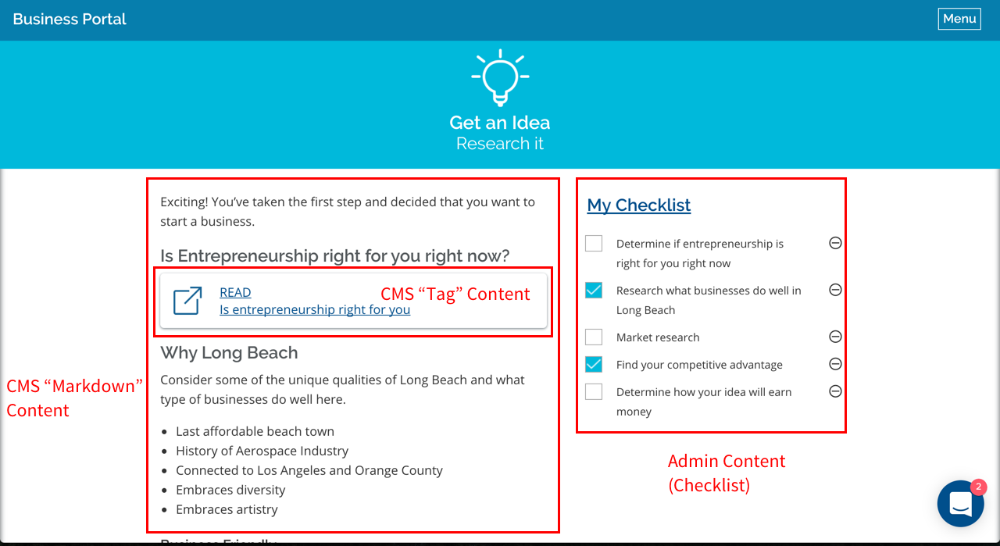
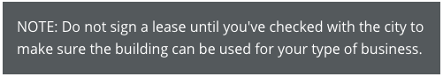

# Content Editing Instructions

## Becoming an Admin

In order to edit content, you'll need to be made an "admin" user. Any existing admin user can do this for you by visiting the Users Admin page (`<your-site's-URL>/admin/users`) and creating a new user for you with admin privileges. If there are no existing Admin users, just let the software engineer who set up the application know that they need to create a user for you with the attribute `role: 'admin'`.

### Logging In
To log in to the CMS, first visit `/admin` and enter your username and password. If you're already able to view the "dashboard" (should have a couple of graphs/charts on it) at `/admin`, then you're logged in! Once you're in, change the URL to `/cms` to get to the CMS editing view.

## Content Types

The content for most pages on BizPort is managed through the content management system (CMS), and can be edited by a non-technical user without coding knowledge. Most pages are made up of a few types of content:
 - CMS "Markdown" Content
 - CMS "Tag" Content

Here's a typical page on BizPort that contains all of these types:


Each of these types is discussed in more detail below.

### CMS "Markdown" Content
The majority of BizPort content is text. In the CMS, this text is written using a common open-source programming language called Markdown. Markdown allows you to express text with formatting in a way that works on the web, but is easier to read than pure HTML (the alternative language that most sites use).

The official documentation for Markdown is available [here](https://daringfireball.net/projects/markdown/syntax), but one of the fastest ways to learn Markdown is by just trying it out in a live online editor like http://dillinger.io/. An editor like this allows you to edit Markdown on the left and see what the rendered result will be on the right.

For examples and quick reference, here are some of the most commonly-used bits of Markdown syntax:

```markdown
[link to another page](http://longbeach.gov/)
```
[link to another page](http://longbeach.gov/)

---

```markdown
 - Bullet 1
 - Bullet 2
 - Bullet 3
```
 - Bullet 1
 - Bullet 2
 - Bullet 3

---

```markdown
 1. Numbered Item 1
 1. Numbered Item 2
 1. Numbered Item 3
```
 1. Numbered Item 1
 1. Numbered Item 2
 1. Numbered Item 3

Note that your items will magically be numbered in order if you just put `1.` in front of all of them!

---

```markdown
Markdown | Less | Pretty
--- | --- | ---
*Still* | `renders` | **nicely**
1 | 2 | 3
```
It is possible to use inline Markdown syntax for [tables](https://github.com/adam-p/markdown-here/wiki/Markdown-Cheatsheet#tables), but that is not recommended. To create responsive/mobile-friendly tables, use full HTML markup with an appropriate responsive modifier instead. Find available responsive modifiers in Foundation's [docs](https://foundation.zurb.com/sites/docs/table.html). 

```html
<div class="table-scroll">
  <table></table>
</div>
```

In the example above, the responsive modifier is `table-scroll` and follows the keyword `class`.

### CMS "Tag" Content

The CMS supports a special syntax, called a "tag" (`{{...}}`), that allows you to write a small amount of code and get back a complex item on the page like a map or button. Below are the tags that have currently been created for BizPort. A software engineer can build new ones if you have a need not provided for here.

### General

Tags are structured as follows:
 - `cms:partial:`: They always start with this - this tells the CMS that it's a tag
 - `shared/<name-of-tag>`: Which type of tag it is
 - `:<argument-1>:<argument-2>:<etc>`: Any "arguments" (additional pieces of information) that the tag needs in order to display what you want. This information will be different for each type of tag. Have a look at some of the examples below to get an idea of what those different pieces of info might be. Keep in mind that the *order of this information is important*. For example, a `shared/contact_box_combo` tag always needs phone number first, then email, resulting in `{{ cms:partial:shared/contact_box_combo:"(562) 570-6211":"LBBIZ@longbeach.gov" }}`

### Video Tag
This tag can be used anywhere to create a Youtube video embed: `{{ cms:partial:shared/video_embed_youtube:"https://www.youtube.com/embed/3ZtdlSmlC44" }}`

### Info Category Pages

The following tags can be used on the "info category" pages throughout the site - the pages on how to start a business that are linked from the homepage and comprise most of the structure of the site.

```html
{{ cms:partial:shared/link_box:"https://paydirect.link2gov.com/LBCbuslicense/ItemSearch":"PAY":"Renewal Fee Online" }}
{{ cms:partial:shared/location_map:"SBDC: Downtown Long Beach Office":"309 Pine Ave, Long Beach, CA 90802" }}
{{ cms:partial:shared/contact_box_combo:"(562) 570-6211":"LBBIZ@longbeach.gov" }}
{{ cms:partial:shared/contact_box:"phone":"(562) 570-6105" }}
{{ cms:partial:shared/contact_box:"email":"test@example.com" }}
```

To create a visually distinct box for high-priority information, use the `callout` class right below the content you want to highlight.
```markdown
NOTE: Do not sign a lease until you've checked with the city to make sure the building can be used for your type of business.
{: .callout}
```


#### "Read More" Sections

To make a section of content collapse if it goes beyond a certain height (presently set at 600px), simply add the class `readmore-section` right underneath the header of that section.

Example:
```markdown
## Title of This Section
{: .readmore-section}

Copy for this section.
```

### Contact Page

Each contact accordion section (for a particular agency, department, etc.) is created with the following code:

```html
<ul class="accordion modules" data-accordion="true" data-allow-all-closed="true">
  <li class="accordion-item modular-box" data-accordion-item="true">
    <a class="accordion-title step-group-title text-centered">
      <div class="step-group-title-text">
        <div class="text">
          <strong>Long Beach City Hall</strong>
          <div>Protects citizens through legal enforcement</div>
        </div>
        <div class="arrow"></div>
      </div>
    </a>
    <div class="accordion-content" data-tab-content="true">
      {{ cms:partial:shared/modular_box:'phone':'562-570-6555' }}
      {{ cms:partial:shared/modular_box:'hours':'7:30am-4:30pm M-F' }}
      {{ cms:partial:shared/modular_box:'map':"333 W Ocean Blvd, Long Beach, CA 90802" }}
      {{ cms:partial:shared/modular_box:'bus':"Metro Blue Line" }}
      {{ cms:partial:shared/modular_box:'bike':"Bike racks and bike share pods available." }}
      {{ cms:partial:shared/modular_box:'parking':"Parking is available at 332 West Broadway Avenue; the first 30 minutes are free, and each additional 20 minutes cost $1.25, with a maximum fee of $7.50. Metered parking is also available along Broadway and Cedar, directly in front of City Hall." }}
    </div>
  </li>
</ul>
```

Currently supported content types are `phone`, `email`, `hours`, `map`, `bus`, `bike`, `parking`. Note that content with line breaks (e.g. a list of different daily hours) is not supported with this module. If a particular section needs multi-line content, the module (`{{...}}`) can be replaced with the following HTML:

```html
<div class="contact-pane">
  <div class="contact-pane-section">
    <i class="icon icon-hours"></i> <!-- note that the class name here determines the icon -->
  </div>
  <div class="contact-pane-section">
    <!-- YOUR CUSTOM HTML HERE (e.g. list <ul> items) -->
  </div>
</div>
```
